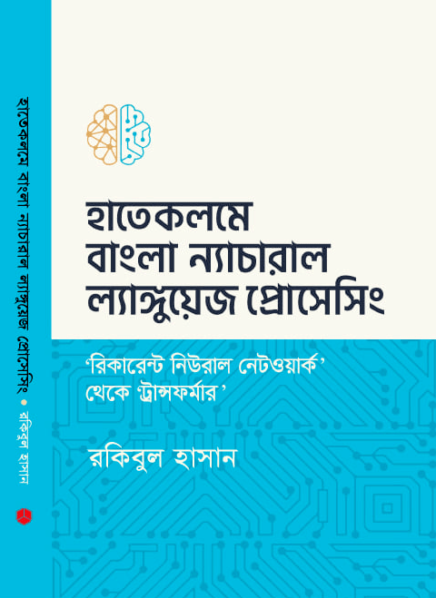
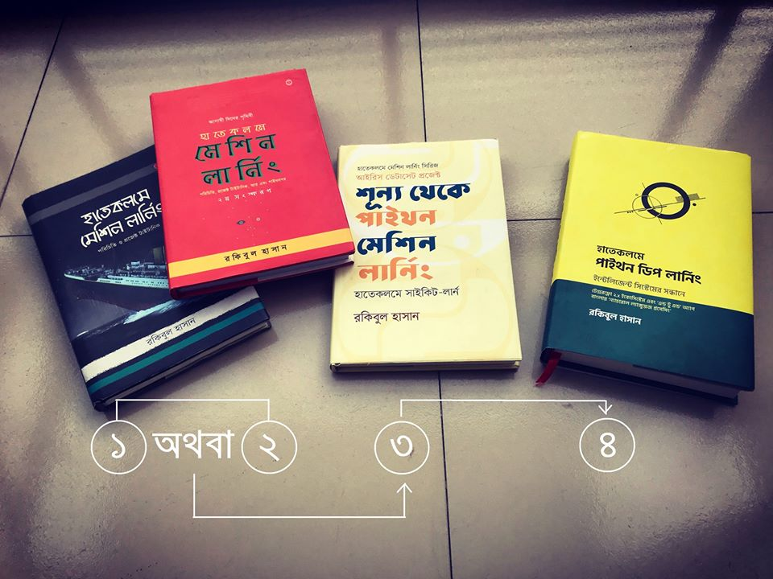

## টেন্সরফ্লো দিয়ে সহজ বাংলায় 'বাংলা' ন্যাচারাল ল্যাঙ্গুয়েজ প্রসেসিং (এনএলপি)



[পাবেন এখানে - রকমারি](https://www.rokomari.com/book/209335/)

বইটা লিখতে চেয়েছিলাম সামনের বছর। তবে, এই ৫২ বছর বয়সে সময় পাওয়া দুস্কর। তবে, লকডাউনের সুবিধা নিয়ে এই বইটায় হাত দেয়া।

[ আমি বই লিখি না, বরং ৫০ বছরের এক্সপেরিয়েন্স শেয়ার করি] কিছুটা কানেক্টিং দ্য ডটের মতো।

## বইয়ের সূচী

<figure>
  
  <figcaption>হাতেকলমে 'বাংলা' ন্যাচারাল ল্যাঙ্গুয়েজ প্রসেসিং সূচী ১</figcaption>
</figure>
<figure>
  
  <figcaption>হাতেকলমে 'বাংলা' ন্যাচারাল ল্যাঙ্গুয়েজ প্রসেসিং সূচী ২</figcaption>
</figure>
<figure>
  
  <figcaption>হাতেকলমে 'বাংলা' ন্যাচারাল ল্যাঙ্গুয়েজ প্রসেসিং সূচী ৩</figcaption>
</figure>
<figure>
  
  <figcaption>হাতেকলমে 'বাংলা' ন্যাচারাল ল্যাঙ্গুয়েজ প্রসেসিং সূচী ৪</figcaption>
</figure>
<figure>
  
  <figcaption>হাতেকলমে 'বাংলা' ন্যাচারাল ল্যাঙ্গুয়েজ প্রসেসিং সূচী ৫</figcaption>
</figure>

## বইয়ের অডিও/ভিডিও

এই নোটবুকগুলো একটা বইয়ে দাড়িয়ে যাবে। ভিডিও/অডিও/ভিডিও পডকাস্ট পাবেন; 

১. https://www.facebook.com/mltraining/ 

২. https://aiwithr.github.io/nlpbook/

৩. https://aiwithr.github.io/resources/

## আগের বইগুলো


---
## কিভাবে শুরু করবেন? বই কোথায় পাবো?

হাতেকলমে শেখার জন্য চারটা বই। আরেকটা নতুন বই ডিপ লার্নিং নিয়ে। সামনে দেখুন। মেশিন লার্নিং বই দুটো শেষ করে ধরা যাবে ডিপ লার্নিং বই। সবগুলো বই অনলাইনে দেয়া আছে। ধারণা পাবার জন্য সব বই একসাথে পাবার [রকমারি লিংক](https://www.rokomari.com/book/187570/)। 

| বইয়ের নাম | অনলাইন লিংক | প্রিন্ট বই | ইউটিউব লিংক |
| :--- | :--- | :--- | :--- |
| হাতেকলমে মেশিন লার্নিং \(দ্বিতীয় সংস্করণ\) | [গিটবুক](https://raqueeb.gitbooks.io/mlbook-titanic/content/) | [রকমারি](https://rokomari.com/book/174186/) | [প্লেলিস্ট](http://bit.ly/ml-2nd) |
| 'শূন্য থেকে পাইথন মেশিন লার্নিং' \(দ্বিতীয় সংস্করণ\) | [গিটবুক](https://raqueeb.gitbook.io/scikit-learn/) | [রকমারি](https://www.rokomari.com/book/187277/) | [প্লেলিস্ট](http://bit.ly/ml-py2) |
| হাতেকলমে পাইথন ডিপ লার্নিং | [গিটবুক](https://rakibul-hassan.gitbook.io/deep-learning/) | [রকমারি](https://www.rokomari.com/book/198757/) | [প্লেলিস্ট](https://www.youtube.com/playlist?list=PL5NPSn95n_L64yse4BRzRYFn5HTYw1Ewb) |
| হাতেকলমে বাংলা ন্যাচারাল ল্যাঙ্গুয়েজ প্রসেসিং | [গিটহাব](https://github.com/raqueeb/nlp_bangla) | [রকমারি](https://www.rokomari.com/book/209335/) | [প্লেলিস্ট](https://www.youtube.com/playlist?list=PL5NPSn95n_L4sMoCygyX3cKkSOKdQA_BT) |
| তিনটা বই একসাথে কেনার লিঙ্ক | আসবে | [রকমারি](https://www.rokomari.com/book/187570/) | [ভবিষ্যত](https://www.youtube.com/playlist?list=PL5NPSn95n_L5UIuCYp0ZUAVB-DBkGh9pZ) |

## সবুজ-হলুদ, লাল রঙের বই আর সাদা রঙের বই - এই দুটোর মধ্যে কোনটা দিয়ে আগে শুরু করব এবং কোনটা কোন সময়ের জন্য উপযোগী?

1. [কালো বই = বাজারে নেই, লাল বইয়ের প্রথম সংস্করণ](https://www.rokomari.com/book/160337/) \(প্রয়োজন নেই\)
2. [লাল বই = হাতেকলমে মেশিন লার্নিং](https://www.rokomari.com/book/174186/), দ্বিতীয় সংস্করণ \(আর এবং পাইথন\), _\(কোন ল্যাঙ্গুয়েজ জানার দরকার নেই, যা শিখতে হবে সেটা দেয়া আছে বইয়ে\)_
3. [সাদা বই = শূন্য থেকে পাইথন মেশিন লার্নিং](https://www.rokomari.com/book/187277/) \(শুধু পাইথন\)
4. [সবুজ-হলুদ = হাতেকলমে পাইথন ডিপ লার্নিং](https://www.rokomari.com/book/198757/) \(হার্ডকাভার\)

```bash
মেশিন লার্নিং বই
১. ├── লাল বই = হাতেকলমে মেশিন লার্নিং 
-. | অথবা
২. ├── কালো বই = বাজারে নেই, লাল বইয়ের প্রথম সংস্করণ
৩.     ├── সাদা বই = শূন্য থেকে পাইথন মেশিন লার্নিং                        
৪.         ├── সবুজ-হলুদ = হাতেকলমে পাইথন ডিপ লার্নিং      # অ্যাডভান্সড ব্যবহারকারীদের জন্য   
৫.            └── প্রকাশিতব্য = বাংলায় ন্যাচারাল ল্যাঙ্গুয়েজ প্রসেসিং   # যারা ল্যাঙ্গুয়েজ নিয়ে কাজ করতে চান
```

#### ১. হাতেকলমে মেশিন লার্নিং \(দ্বিতীয় সংস্করণ\)

\(ক\) মেশিন লার্নিং শেখার শুরুটার জন্য সবচেয়ে ভালো হচ্ছে বই। বইগুলো লেখা হয়েছে 'স্টেপ বাই স্টেপ' আঙ্গিকে। কোন বই শুরু করতে প্রোগ্রামিংয়ের পূর্ব অভিজ্ঞতা দরকার নেই। ১ম বইয়ের লিংক : [https://rokomari.com/book/174186/](https://rokomari.com/book/174186/) \(দ্বিতীয় সংস্করণ হলেই চলবে\) বই না কিনতে চাইলে পুরো বই অনলাইনে পাবেন ১ম সংস্করণ। লিংক [https://raqueeb.gitbooks.io/mlbook-titanic/content/](https://raqueeb.gitbooks.io/mlbook-titanic/content/) । এই বইয়ের ভিডিও সিরিজ আছে ইউটিউব প্লেলিস্ট হিসেবে [http://bit.ly/ml-2nd](http://bit.ly/ml-2nd) ।

\[প্রথম সংস্করণ শুধুমাত্র 'আর প্রোগ্রামিং' এনভায়রনমেন্ট দিয়ে ছিলো। সেটা প্রতিস্থাপিত হয়েছে দ্বিতীয় সংস্করণ দিয়ে। প্রথম সংস্করণ যারা কিনেছেন, তাদের দ্বিতীয় সংস্করণ ব্যবহার করতে হবে না। যারা দ্বিতীয় সংস্করণ কিনেছেন তাদের প্রথম সংস্করণ দরকার নেই\]

#### ২. 'শূন্য থেকে পাইথন মেশিন লার্নিং' \(দ্বিতীয় সংস্করণ\)

\(খ\) যারা শুধুমাত্র পাইথন দিয়ে মেশিন লার্নিং শিখতে চান, কিন্তু পাইথন জানেন না, তাদের জন্য আরেকটা বই, 'শূন্য থেকে পাইথন মেশিন লার্নিং'। প্রিন্ট বই এর লিঙ্ক [https://www.rokomari.com/book/187277/](https://www.rokomari.com/book/187277/) পড়ে দেখতে চাইলে লিংক: [https://raqueeb.gitbook.io/scikit-learn/](https://raqueeb.gitbook.io/scikit-learn/) । এই বইয়ের ভিডিও সিরিজ আছে ইউটিউব প্লেলিস্ট হিসেবে [http://bit.ly/ml-py2](http://bit.ly/ml-py2) ।

####  ৩. হাতেকলমে পাইথন ডিপ লার্নিং \(অনলাইন এবং হার্ডকপি সংস্করণ\)

\(গ\) যারা ডিপ লার্নিং শিখতে চান, তাদের ট্র্যাক হচ্ছে শুরুতে পাইথনের বই,[ 'শূন্য থেকে পাইথন মেশিন লার্নিং'](https://www.rokomari.com/book/187277/) এবং পরের বই ["হাতেকলমে পাইথন ডিপ লার্নিং"](https://rakibul-hassan.gitbook.io/deep-learning/)। আগের বইটা ছাড়া পরের বইটা শুরু করা যাবে না। বইটা আছে অনলাইনে। প্রিন্ট সংস্করণ আসছে এই জানুয়ারিতে। 

\(ঘ\) **হাতেকলমে পাইথন ডিপ লার্নিং** বইয়ের হার্ডকপি লিংক: [https://www.rokomari.com/book/198757/](https://www.rokomari.com/book/198757/) এবং অনলাইনে পড়তে চাইলে [https://rakibul-hassan.gitbook.io/deep-learning/](https://rakibul-hassan.gitbook.io/deep-learning/) লিংক।

## বইয়ের দোকান থেকে কিনতে পাওয়া যাবে?

অথবা,

## নীলক্ষেতে কোন দোকানগুলোতে পাওয়া যাবে?

> \(ঙ\) হার্ডকপি পাওয়া যাবে রকমারি, আদর্শ, বাতিঘরসহ বেশ কয়েকটা লাইব্রেরিতে। নীলক্ষেতেও পাওয়া যায় কয়েকটা দোকানে। **মানিক লাইব্রেরী নীলক্ষেত ঢাকা**, ০১৭৩৫৭৪২৯০৮ এবং **হক লাইব্রেরী নীলক্ষেত** ০১৮২০১৫৭১৮১ / ০১৫১১১৫৭১৮১ / ০১৭৪৩৫১৬৩৪৪।

## ভিডিও দেখে শিখতে চাই, ইউটিউব লিংক

\(চ\) মেশিন লার্নিং নিয়ে ১০০+ ভিডিও সিরিজ পাবেন ইউটিউব এবং ফেসবুকে। প্লে-লিস্ট হিসেবে।

> * ইউটিউব প্লে-লিস্ট: [http://bit.ly/ml-2nd](http://bit.ly/ml-2nd) এবং [http://bit.ly/ml-py1](http://bit.ly/ml-py1) এবং [http://bit.ly/ml-py2](http://bit.ly/ml-py2)
> * ইউটিউব চ্যানেল: [http://bit.ly/ml-trng](http://bit.ly/ml-trng) 
> * ফেসবুক প্লে-লিস্ট [https://www.facebook.com/pg/mltraining/videos/](https://www.facebook.com/pg/mltraining/videos/) লিংকে গিয়ে খুঁজুন "হাতেকলমে মেশিন লার্নিং \(দ্বিতীয় সংস্করণ\) ভিডিও সিরিজ"
---
